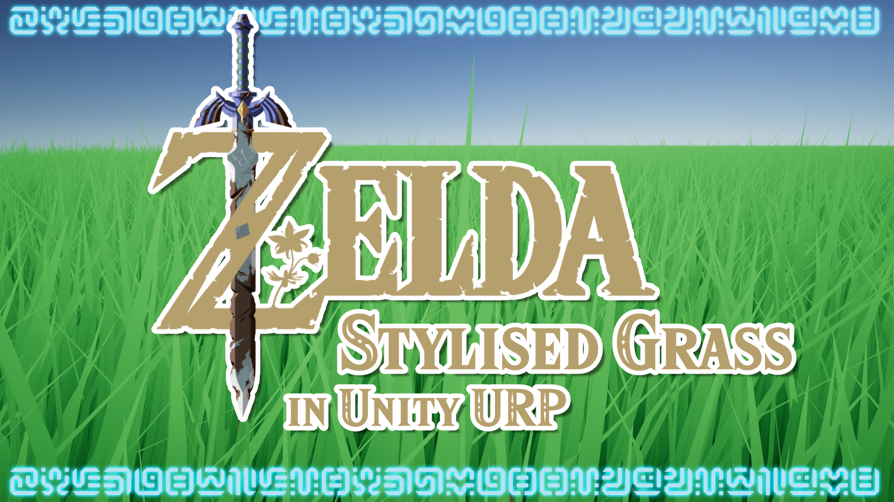

# Breath of the Wild Stylised Grass in Unity URP

A recreation of *Zelda: Breath of the Wild*'s stylised grass effect using a shader in Unity URP.

## Overview

Grass can help tie together a scene, especially large open areas like those you'll find in open world games. This effect uses geometry and tessellation shaders to look like the grass in *Zelda: Breath of the Wild*.

## Software

This project was created using Unity 2020.2.1f1 and Universal Render Pipeline 10.2.2.

## Authors

This project and the corresponding tutorial was created by Daniel Ilett.

### Other Creators

This effect is based on tutorials by many people. Check them out!

- [Roystan Grass Shader](https://roystan.net/articles/grass-shader.html)
- [Cyanilux URP Shaders](https://cyangamedev.wordpress.com/2020/06/05/urp-shader-code/)
- [Catlike Coding Tessellation Shader](https://catlikecoding.com/unity/tutorials/advanced-rendering/tessellation/)
- [Ben Golus Shadow Code](https://forum.unity.com/threads/water-shader-graph-transparency-and-shadows-universal-render-pipeline-order.748142/#post-5518747 )
- [Daniel Santalla Snow Shader](https://twitter.com/danielsantalla/status/1391135820229222401)
- [MinionsArt Grass Painting Tool](https://www.youtube.com/watch?v=xKJHL8nQiuM)

## Release

This project was released publicly on June 30th 2021 alongside a [YouTube tutorial](https://www.youtube.com/watch?v=MeyW_aYE82s) outlining the steps taken to make the effect
